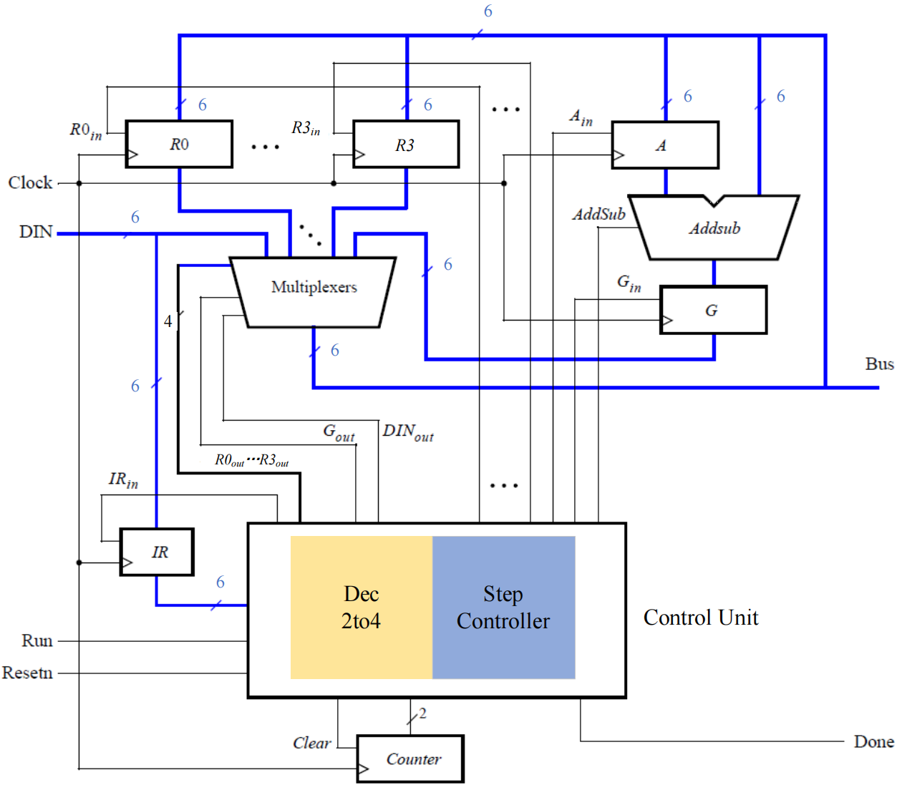

# Very Simple CPU on Genesys2

## ⛓ Prerequisites

1. 如果想直接打开 `.xpr` 工程，需要vivado 2022.2；但是仍可以使用 `./rtl` 与约束文件 `./constrs` ；
2. 如果是使用Genesys2，约束文件可直接使用；否则需要自行修改；
3. 可能需要简单配置clock wizard与ILA IP；

## 🛠️ 系统架构

该CPU仅4个指令：移动寄存器、装载立即数、加减法。通过Genesys2上的开关实现指令输入，按键实现CPU执行，LED灯查看总线数据，可通过ILA查看波形。

### 📊 系统框图

### 📜 指令格式

II XX YY

- II：指令；
- XX：表示 `Rx` 寄存器；
- YY：表示 `Ry` 寄存器；

四个指令如下：

|          |          MV          |       MVI       |              ADD              |              SUB              |
| :------: | :------------------: | :--------------: | :----------------------------: | :----------------------------: |
|   编码   |          00          |        01        |               10               |               11               |
| 汇编指令 |    `MV Rx, Ry`    |  `MVI Rx, #D`  |         `ADD Rx, Ry`         |         `SUB Rx, Ry`         |
|   功能   | `Rx` ← `[Ry]` | `Rx` ← `D` | `Rx` ← `[Rx]` + `[Ry]` | `Rx` ← `[Rx]` - `[Ry]` |

`#D`：立即数

### ⏲️ 控制时序

| 指令/时间 |  T0  |          T1          |           T2           |         T3         |
| :-------: | :---: | :------------------: | :---------------------: | :----------------: |
|    `MV`    | `IR` in | `RY` out, `RX` in, done |            /            |         /         |
|    `MVI`    | `IR` in | `DIN` out, `RX` in, done |            /            |         /         |
|    `ADD`    | `IR` in |     `RX` out, `A` in     | `RY` out, `G` in, `Addsub=0` | `G` out, `RX` in, `done` |
|    `SUB`    | `IR` in |     `RX` out, `A` in     | `RY` out, `G` in, `Addsub=1` |  `G` out, `RX` in, `done`  |

⚠️ 注意：

1. `MV` 与 `MVI` 需要两个周期；`ADD` 与 `SUB` 需要4个周期。

2. `Addsub`：ALU控制信号，`Addsub=0` 为加法；`Addsub=1` 为减法。

3. 实际控制时序由**手动按键触发**，即系统框图中的 `Clock` ；RTL代码中的时钟仅为提供给ILA使用。

### 📌 验证示例

1. 装载立即数：`MVI R3, 0'b000_001`；CPU执行过程：

   1. 第1个cycle，SW输入：01_11_XX（指令：`MVI`，`RX=3`，`RY` 不关心）；
   2. 第2个cycle，SW输入：000001，即输入的6位立即数；

2. 移动寄存器：`MV R2, R3`；CPU执行过程：

   1. 第1个cycle，SW输入：00_10_11（指令：`MV`，`RX=2`，`RY` 不关心）；
   2. 第2个cycle，SW输入：不关心；

3. 加法指令：`ADD R2, R3`；CPU执行过程：

   1. 第1个cycle，SW输入：10_10_11（指令：`ADD`，`RX=2`，`RY=3`）；
   2. 第2个、第3个、第4个cycle，SW输入：不关心；

4. 减法指令：`SUB R2, R3`；CPU执行过程：

   1. 第1个cycle，SW输入：11_10_11（指令：`SUB`，`RX=2`，`RY=3`）；
   2. 第2个、第3个、第4个cycle，SW输入：不关心；
